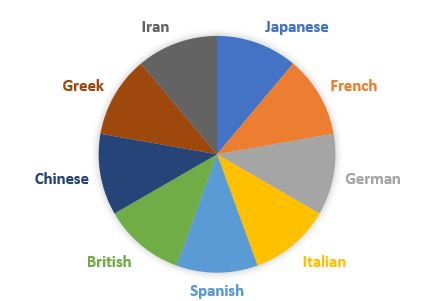

# Project  MET Artworks Classification 

Authors :

- Abdallah GAZAL
- Terence NGO
- Cynthia WANG
- Loïc MARY

## Context

  The art market reached a world record in 2021: auctions reached a total of $17 billion. This market is not the best known, but it is growing and more and more people want to buy a work of art. In this context, machine learning could play a major role in the development of the art market. To project oneself and precisely understand the possible contributions of machine learning to the art market, it is necessary to start from the current problems of the market. If we look in more detail at main actors of the market (buyers, sellers, etc.), one of their major issue is the valuation of art objects. Usually, professionals give an estimate of the value by carrying out a scrupulous examination of the object. However, their work is tedious, time-consuming and the estimate could be wrong. 

## Definition of the problem

Our idea is to use machine learning to help decision-making in the process of evaluating an art object. In this work, we will focus on a specific aspect of the evaluation process: estimating the culture of the artwork. This is a very important information needed by the the appraisal professional in order to give a value to the object. 

In this challenge, we will only try to predict the culture (among 8 classes)  of a specific artwork. Therefore, we will have to deal with a classification problem. In order to perform this classification, we use transfert learning with vgg16: 

* Given a picture of the object we will try to predict from which culture the object is from

## About the notebooks
In the folder `notebooks` There is a notebook `train_model.ipynb` which contains the code to train a model with the GPU of colab. There is no need in executing this file because we
saved the model in the file `vgg16_culture_customized.h5` stored in the folder model.
If you want to execute a notebook to see the performance of this model, you can use `performance_model_vgg16.ipynb `

## Metrics used 

* The Negative log likelihood, this loss function is often used for multiclass classification problems
* We will also look at the accuracy of our results

## Applications
I made a website where you upload an image and you can get the culture of the artwork represented.
All the files are stored in the folder Applications
I made the `backend` with `FastAPI` and the `frontend` with `streamlit`.
To run the Application, you have to use 2 terminals at the root of this repo and run the following commands:
 * 1st terminal : uvicorn Applications.backend:app --reload
 * 2nd terminal : streamlit run Applications/frontend.py
